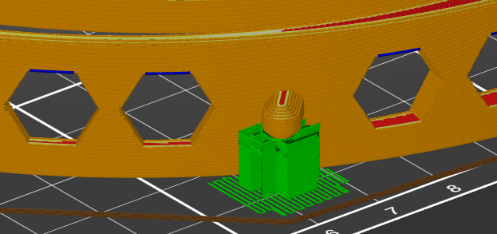

MakerNexus local modifications
------------------------------

At [MakerNexus], we're working on making as many face-shields as possible;
They will be in dire demand very soon and we got requests of thousands of them.
MakerNexus is coordinating the contact with the local hospitals and
as well the effort of non-Members of the maker-space to 3D print. We
have enough shield material to laser-cut, but of course 3D printing is the
slow part of manufacturing.

Please check out the [project page] if you are in the San Francisco
Bay Area and want to help.

We are using the [Prusa-rc3] design, but needed some modifications requested
by the local healthcare community.

### Design goals

When reviewing, the local healthcare providers requested

   * Weight-reduce front-part if possible.
   * Move the shield pins up so that there is material behind the openings
     of the shield-punches

Moving up the shield-pin requires a little bit of support material, but it
is not a problem to generate the necessary STL file where the supports should
be and use that in the Prusa slicer as support modifier.

### Download

Choose what bests fits your circumstances. GCode is 'ready to go', 3mf allows
printer adjustments, *.stl allows to use in your own slicer.

Simply get the [latest release](https://github.com/hzeller/prusa-covid19-shield-remix/releases).

#### Release content

We distinguish between 'normal shield' and 'short shield': the shorter one
only prints 15mm high (vs the normal 20mm) and does not have hexagons. It has
*not* been tested yet if it is stable enough for holding the shield, so **for
now only print the normal shield** until further notice.

 * [normal_shield_0.3mm_PETG_MK3S.gcode](./normal_shield_0.3mm_PETG_MK3S.gcode)
   GCode files ready to go on Prusa MK3(s) with
   0.3mm layer, 100% infill, 240°C temp for PETG printing.
 * [normal_shield.3mf](./normal_shield.3mf) for direct use in prusa-slicer
   (or other slicers that understand 3mf files).
 * [normal_shield_with_support.stl](./normal_shield_with_support.stl) and
   [normal_no_with_support.stl](./normal_shield_no_support.stl): normal
   shield. The *support* version has already a support column inncluded
   for printing the pin. If you chose the *no support* version, you need
   to use your slicer to create support for these.

### Code

A simple OpenSCAD file that take the original STL and does the necessary
surgical changes.

### Slicer project file
A 3mf file is provided, so it can be loaded into slicer right away:

```
git clone https://github.com/hzeller/prusa-covid19-shield-remix.git
cd prusa-covid19-shield-remix
prusa-slicer prusa-covid-shield-remix.3mf
```

Support is needed, but only minimally, and it breaks off easily. The STL for
the support enforcers is also generated from the OpenSCAD file.



### GCode
There is also [gcode directly sliced for Prusa MK3(s)](prusa-covid-shield-remix-print_shield_0.3mm_PETG_MK3S.gcode) that prints two headbands on the
build-plate.

### Development

For building, use the Makefile to create all the artifacts from the *.scad
file

```
make
```

### License

License: [CC-BY-NC]

This is based on the Prusa design
https://www.prusaprinters.org/prints/25857-prusa-protective-face-shield-rc2

[MakerNexus]: https://www.makernexus.com/
[prusa-rc3]: https://www.prusaprinters.org/prints/25857-prusa-protective-face-shield-rc3
[CC-BY-NC]: https://creativecommons.org/licenses/by-nc/4.0/
[project page]: http://makernexuswiki.com/index.php?title=3D_printed_face_shields
[prusa-slicer]: https://www.prusa3d.com/prusaslicer/